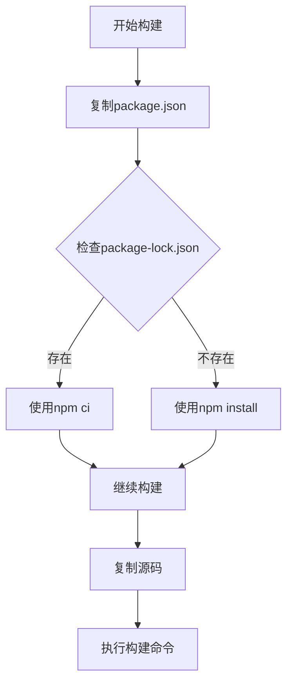
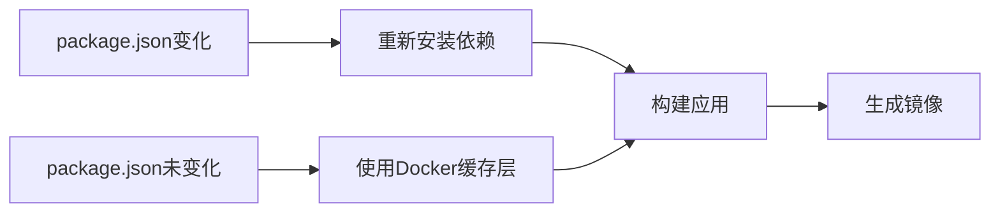

# Docker构建错误修复设计文档

## 概述

mindmap-qoder项目在Docker构建过程中遇到 `npm ci` 命令执行失败的问题。错误原因是项目中缺少必需的 `package-lock.json` 文件，导致多阶段构建无法正常进行依赖安装。

## 问题分析

### 错误详情
```
npm ERR! The `npm ci` command can only install with an existing package-lock.json or
npm ERR! npm-shrinkwrap.json with lockfileVersion >= 1. Run an install with npm@5 or
npm ERR! later to generate a package-lock.json file, then try again.
```

### 根本原因
1. **缺失锁文件**: `server/` 和 `web/` 目录缺少 `package-lock.json` 文件
2. **构建策略不当**: Dockerfile使用 `npm ci` 命令但没有对应的锁文件
3. **依赖管理不一致**: 各模块依赖管理策略不统一

### 项目结构分析
```
├── server/               # 后端服务 (缺少package-lock.json)
│   ├── package.json     # ✓ 存在
│   └── package-lock.json # ✗ 缺失
├── web/                 # 前端应用 (缺少package-lock.json)  
│   ├── package.json     # ✓ 存在
│   └── package-lock.json # ✗ 缺失
└── simple-mind-map/     # 核心库 (有package-lock.json)
    ├── package.json     # ✓ 存在
    └── package-lock.json # ✓ 存在
```

## 解决方案架构

### 方案选择矩阵

| 方案 | 优点 | 缺点 | 复杂度 | 推荐度 |
|------|------|------|--------|---------|
| 生成锁文件 | 版本精确控制 | 需要本地环境 | 低 | ⭐⭐⭐⭐⭐ |
| 替换为npm install | 简单快速 | 版本可能不一致 | 极低 | ⭐⭐⭐ |
| 使用yarn | 现代包管理 | 改变技术栈 | 中 | ⭐⭐ |

### 推荐方案：混合依赖安装策略

采用灵活的依赖安装方式，根据锁文件存在情况选择合适的安装命令。

## 技术实现设计

### Dockerfile优化方案

#### 1. 依赖安装策略改进


#### 2. 多阶段构建优化
- **前端构建阶段**: 处理web和simple-mind-map模块
- **后端构建阶段**: 处理server模块  
- **生产运行阶段**: 合并构建产物并配置运行环境

### 构建脚本改进

#### 前端构建阶段修改
```dockerfile
# 阶段1: 构建前端应用
FROM node:16-alpine AS frontend-builder
WORKDIR /app

# 复制package文件
COPY web/package*.json ./web/
COPY simple-mind-map/package*.json ./simple-mind-map/

# 智能依赖安装
RUN cd web && (test -f package-lock.json && npm ci || npm install --only=production)
RUN cd simple-mind-map && (test -f package-lock.json && npm ci || npm install --only=production)
```

#### 后端构建阶段修改  
```dockerfile
# 阶段2: 构建后端应用
FROM node:16-alpine AS backend-builder
WORKDIR /app

# 复制package文件
COPY server/package*.json ./

# 智能依赖安装
RUN test -f package-lock.json && npm ci --only=production || npm install --only=production
```

### 构建性能优化

#### 缓存策略优化


#### 镜像大小优化措施
- 使用 `alpine` 基础镜像减小体积
- 多阶段构建避免开发依赖进入生产镜像
- 清理npm缓存减少镜像大小

## 实施计划

### 阶段1: Dockerfile修复 (立即执行)
1. 修改前端构建阶段的依赖安装逻辑
2. 修改后端构建阶段的依赖安装逻辑  
3. 保持生产运行阶段不变

### 阶段2: 依赖管理规范化 (可选)
1. 为server和web模块生成package-lock.json
2. 统一项目依赖管理策略
3. 更新CI/CD流程

### 阶段3: 构建优化 (后续改进)
1. 优化Docker构建缓存策略
2. 减小最终镜像体积
3. 提升构建速度

## 验证测试

### 构建测试用例

#### 测试场景1: 正常构建流程
```bash
# 验证修复后的构建过程
docker build -t mindmap-qoder:test .
docker run -d -p 8080:80 mindmap-qoder:test
```

#### 测试场景2: 模块化测试
```bash
# 分别测试各个构建阶段
docker build --target frontend-builder -t test-frontend .
docker build --target backend-builder -t test-backend .
```

### 验证标准
- [ ] 前端构建阶段成功完成
- [ ] 后端构建阶段成功完成  
- [ ] 最终镜像可以正常启动
- [ ] 容器内服务正常运行
- [ ] 健康检查通过

## 风险评估

### 潜在风险及缓解措施

| 风险 | 影响级别 | 缓解措施 |
|------|----------|----------|
| 依赖版本不一致 | 中等 | 后续生成锁文件固化版本 |
| 构建时间增加 | 低 | 利用Docker构建缓存 |
| 镜像体积增大 | 低 | 使用多阶段构建清理临时文件 |

### 回滚策略
如果新的构建方式出现问题，可以：
1. 恢复原始Dockerfile
2. 为各模块快速生成package-lock.json文件
3. 使用传统的npm ci方式

## 长期改进建议

### 依赖管理现代化
- 考虑迁移到更现代的包管理工具(如pnpm)
- 建立统一的依赖管理规范
- 实施定期依赖更新策略

### 构建流程自动化
- 集成自动化测试到构建流程
- 实现构建结果的自动验证
- 建立构建性能监控```
npm ERR! The `npm ci` command can only install with an existing package-lock.json or
npm ERR! npm-shrinkwrap.json with lockfileVersion >= 1. Run an install with npm@5 or
npm ERR! later to generate a package-lock.json file, then try again.
```

### 根本原因
1. **缺失锁文件**: `server/` 和 `web/` 目录缺少 `package-lock.json` 文件
2. **构建策略不当**: Dockerfile使用 `npm ci` 命令但没有对应的锁文件
3. **依赖管理不一致**: 各模块依赖管理策略不统一

### 项目结构分析
```
├── server/               # 后端服务 (缺少package-lock.json)
│   ├── package.json     # ✓ 存在
│   └── package-lock.json # ✗ 缺失
├── web/                 # 前端应用 (缺少package-lock.json)  
│   ├── package.json     # ✓ 存在
│   └── package-lock.json # ✗ 缺失
└── simple-mind-map/     # 核心库 (有package-lock.json)
    ├── package.json     # ✓ 存在
    └── package-lock.json # ✓ 存在
```

## 解决方案架构

### 方案选择矩阵

| 方案 | 优点 | 缺点 | 复杂度 | 推荐度 |
|------|------|------|--------|---------|
| 生成锁文件 | 版本精确控制 | 需要本地环境 | 低 | ⭐⭐⭐⭐⭐ |
| 替换为npm install | 简单快速 | 版本可能不一致 | 极低 | ⭐⭐⭐ |
| 使用yarn | 现代包管理 | 改变技术栈 | 中 | ⭐⭐ |

### 推荐方案：混合依赖安装策略

采用灵活的依赖安装方式，根据锁文件存在情况选择合适的安装命令。

## 技术实现设计

### Dockerfile优化方案

#### 1. 依赖安装策略改进


#### 2. 多阶段构建优化
- **前端构建阶段**: 处理web和simple-mind-map模块
- **后端构建阶段**: 处理server模块  
- **生产运行阶段**: 合并构建产物并配置运行环境

### 构建脚本改进

#### 前端构建阶段修改
```dockerfile
# 阶段1: 构建前端应用
FROM node:16-alpine AS frontend-builder
WORKDIR /app

# 复制package文件
COPY web/package*.json ./web/
COPY simple-mind-map/package*.json ./simple-mind-map/

# 智能依赖安装
RUN cd web && (test -f package-lock.json && npm ci || npm install --only=production)
RUN cd simple-mind-map && (test -f package-lock.json && npm ci || npm install --only=production)
```

#### 后端构建阶段修改  
```dockerfile
# 阶段2: 构建后端应用
FROM node:16-alpine AS backend-builder
WORKDIR /app

# 复制package文件
COPY server/package*.json ./

# 智能依赖安装
RUN test -f package-lock.json && npm ci --only=production || npm install --only=production
```

### 构建性能优化

#### 缓存策略优化


#### 镜像大小优化措施
- 使用 `alpine` 基础镜像减小体积
- 多阶段构建避免开发依赖进入生产镜像
- 清理npm缓存减少镜像大小

## 实施计划

### 阶段1: Dockerfile修复 (立即执行)
1. 修改前端构建阶段的依赖安装逻辑
2. 修改后端构建阶段的依赖安装逻辑  
3. 保持生产运行阶段不变

### 阶段2: 依赖管理规范化 (可选)
1. 为server和web模块生成package-lock.json
2. 统一项目依赖管理策略
3. 更新CI/CD流程

### 阶段3: 构建优化 (后续改进)
1. 优化Docker构建缓存策略
2. 减小最终镜像体积
3. 提升构建速度

## 验证测试

### 构建测试用例

#### 测试场景1: 正常构建流程
```bash
# 验证修复后的构建过程
docker build -t mindmap-qoder:test .
docker run -d -p 8080:80 mindmap-qoder:test
```

#### 测试场景2: 模块化测试
```bash
# 分别测试各个构建阶段
docker build --target frontend-builder -t test-frontend .
docker build --target backend-builder -t test-backend .
```

### 验证标准
- [ ] 前端构建阶段成功完成
- [ ] 后端构建阶段成功完成  
- [ ] 最终镜像可以正常启动
- [ ] 容器内服务正常运行
- [ ] 健康检查通过

## 风险评估

### 潜在风险及缓解措施

| 风险 | 影响级别 | 缓解措施 |
|------|----------|----------|
| 依赖版本不一致 | 中等 | 后续生成锁文件固化版本 |
| 构建时间增加 | 低 | 利用Docker构建缓存 |
| 镜像体积增大 | 低 | 使用多阶段构建清理临时文件 |

### 回滚策略
如果新的构建方式出现问题，可以：
1. 恢复原始Dockerfile
2. 为各模块快速生成package-lock.json文件
3. 使用传统的npm ci方式

## 长期改进建议

### 依赖管理现代化
- 考虑迁移到更现代的包管理工具(如pnpm)
- 建立统一的依赖管理规范
- 实施定期依赖更新策略

### 构建流程自动化
- 集成自动化测试到构建流程
- 实现构建结果的自动验证
- 建立构建性能监控


