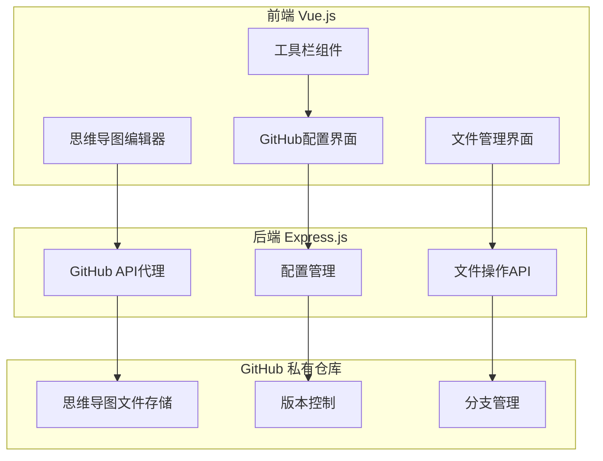
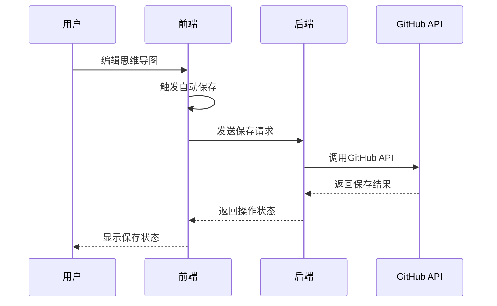
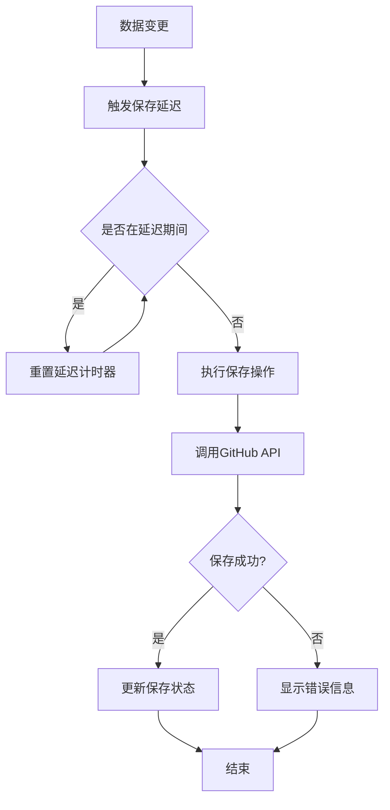

# GitHub存储集成功能设计

## 1. 概述

本设计文档描述了将mindmap-qoder项目的文件存储功能从本地存储改造为GitHub私有仓库存储的完整方案。主要包括删除原有本地文件操作功能，新增GitHub集成配置界面，实现实时/定时自动保存，以及优化Docker部署方案。

### 1.1 项目类型
**全栈应用** - Vue.js前端 + Express.js后端 + simple-mind-map核心库

### 1.2 改造目标
- 移除本地文件操作功能（新建、打开、保存本地文件）
- 集成GitHub私有仓库作为存储后端
- 在工具栏添加GitHub配置按钮
- 实现实时/定时自动保存机制
- 优化Docker容器化部署

## 2. 架构设计

### 2.1 整体架构



### 2.2 数据流设计



## 3. 功能模块设计

### 3.1 GitHub配置模块

#### 3.1.1 配置界面组件
- **组件位置**: `web/src/components/GitHubConfig.vue`
- **功能要求**:
  - GitHub Token验证
  - 仓库选择和验证
  - 分支选择
  - 保存间隔设置
  - 配置信息本地存储

#### 3.1.2 配置数据结构
```javascript
{
  githubConfig: {
    token: String,          // GitHub Personal Access Token
    owner: String,          // 仓库所有者
    repo: String,           // 仓库名称
    branch: String,         // 目标分支
    autoSaveInterval: Number, // 自动保存间隔(秒)
    enableAutoSave: Boolean   // 是否启用自动保存
  }
}
```

### 3.2 文件操作模块

#### 3.2.1 GitHub API集成
- **API服务**: `web/src/api/github.js`
- **核心方法**:
  - `validateToken()` - Token验证
  - `getRepositories()` - 获取仓库列表
  - `getBranches()` - 获取分支列表
  - `saveFile()` - 保存文件到GitHub
  - `loadFile()` - 从GitHub加载文件
  - `deleteFile()` - 删除GitHub文件
  - `getFileList()` - 获取文件列表

#### 3.2.2 自动保存机制


### 3.3 工具栏改造

#### 3.3.1 移除本地文件操作
- 删除"新建文件"按钮
- 删除"打开文件"按钮 
- 删除"另存为"按钮
- 删除本地文件树功能

#### 3.3.2 新增GitHub功能按钮
```javascript
// 新增工具栏按钮配置
const githubButtons = [
  {
    name: 'githubConfig',
    icon: 'iconGitHub',
    text: 'GitHub配置',
    action: 'showGitHubConfig'
  },
  {
    name: 'githubFiles',
    icon: 'iconCloud',
    text: '云端文件',
    action: 'showGitHubFiles'
  }
]
```

### 3.4 后端API设计

#### 3.4.1 API路由结构
```
/api/github/
├── /validate-token      # POST - 验证GitHub Token
├── /repositories        # GET  - 获取仓库列表
├── /branches           # GET  - 获取分支列表
├── /files              # GET  - 获取文件列表
├── /file/content       # GET  - 获取文件内容
├── /file/save          # POST - 保存文件
└── /file/delete        # DELETE - 删除文件
```

#### 3.4.2 API响应格式
```javascript
// 标准响应格式
{
  success: Boolean,
  data: Object|Array,
  message: String,
  error: String
}
```

## 4. 技术实现规范

### 4.1 前端技术栈
- **框架**: Vue.js 2.x
- **状态管理**: Vuex
- **UI组件**: Element-UI
- **HTTP客户端**: Axios
- **路由**: Vue Router

### 4.2 后端技术栈
- **运行时**: Node.js
- **框架**: Express.js
- **HTTP客户端**: Axios
- **中间件**: cors, body-parser

### 4.3 GitHub集成
- **认证方式**: Personal Access Token
- **API版本**: GitHub REST API v3
- **权限要求**: repo (私有仓库访问权限)

## 5. 容器化部署设计

### 5.1 多阶段Dockerfile优化

```dockerfile
# 构建阶段
FROM node:16-alpine AS builder
WORKDIR /app

# 复制依赖文件并安装
COPY package*.json ./
RUN npm ci --only=production

# 复制源代码并构建
COPY . .
RUN npm run build

# 生产阶段
FROM nginx:alpine
COPY --from=builder /app/dist /usr/share/nginx/html
COPY nginx.conf /etc/nginx/conf.d/default.conf
EXPOSE 80
CMD ["nginx", "-g", "daemon off;"]
```

### 5.2 Docker Compose配置

```yaml
version: '3.8'
services:
  frontend:
    build: 
      context: ./web
      dockerfile: Dockerfile
    ports:
      - "80:80"
    environment:
      - NODE_ENV=production
    restart: unless-stopped
    
  backend:
    build:
      context: ./server
      dockerfile: Dockerfile
    ports:
      - "3000:3000"
    environment:
      - NODE_ENV=production
      - PORT=3000
    restart: unless-stopped
    
networks:
  default:
    driver: bridge
```

### 5.3 容器优化策略
- 使用Alpine Linux基础镜像减小体积
- 多阶段构建分离构建环境和运行环境
- 移除不必要的依赖和文件
- 启用nginx gzip压缩
- 设置合适的缓存策略

## 6. 数据模型设计

### 6.1 文件存储结构
```
GitHub Repository/
├── mindmaps/
│   ├── project1.json
│   ├── project2.json
│   └── ...
├── templates/
│   ├── template1.json
│   └── template2.json
└── config/
    └── settings.json
```

### 6.2 文件内容格式
```javascript
{
  "version": "1.0",
  "metadata": {
    "title": "思维导图标题",
    "created": "2024-01-01T00:00:00Z",
    "modified": "2024-01-01T00:00:00Z",
    "author": "作者"
  },
  "data": {
    // simple-mind-map数据结构
  }
}
```

## 7. 安全设计

### 7.1 Token管理
- 前端不存储明文Token
- 后端代理所有GitHub API调用
- 支持Token过期自动刷新
- 配置数据加密存储

### 7.2 访问控制
- 仅支持私有仓库访问
- API请求频率限制
- 输入数据验证和清理
- CORS配置限制

## 8. 测试策略

### 8.1 单元测试
- GitHub API服务类测试
- 自动保存机制测试
- 配置验证逻辑测试
- 文件操作功能测试

### 8.2 集成测试
- 前后端API集成测试
- GitHub API集成测试
- 端到端用户流程测试

### 8.3 测试覆盖率要求
- 核心业务逻辑 >= 90%
- API接口 >= 85%
- 组件功能 >= 80%  - GitHub Token验证
  - 仓库选择和验证
  - 分支选择
  - 保存间隔设置
  - 配置信息本地存储

#### 3.1.2 配置数据结构
```javascript
{
  githubConfig: {
    token: String,          // GitHub Personal Access Token
    owner: String,          // 仓库所有者
    repo: String,           // 仓库名称
    branch: String,         // 目标分支
    autoSaveInterval: Number, // 自动保存间隔(秒)
    enableAutoSave: Boolean   // 是否启用自动保存
  }
}
```

### 3.2 文件操作模块

#### 3.2.1 GitHub API集成
- **API服务**: `web/src/api/github.js`
- **核心方法**:
  - `validateToken()` - Token验证
  - `getRepositories()` - 获取仓库列表
  - `getBranches()` - 获取分支列表
  - `saveFile()` - 保存文件到GitHub
  - `loadFile()` - 从GitHub加载文件
  - `deleteFile()` - 删除GitHub文件
  - `getFileList()` - 获取文件列表

#### 3.2.2 自动保存机制


### 3.3 工具栏改造

#### 3.3.1 移除本地文件操作
- 删除"新建文件"按钮
- 删除"打开文件"按钮 
- 删除"另存为"按钮
- 删除本地文件树功能

#### 3.3.2 新增GitHub功能按钮
```javascript
// 新增工具栏按钮配置
const githubButtons = [
  {
    name: 'githubConfig',
    icon: 'iconGitHub',
    text: 'GitHub配置',
    action: 'showGitHubConfig'
  },
  {
    name: 'githubFiles',
    icon: 'iconCloud',
    text: '云端文件',
    action: 'showGitHubFiles'
  }
]
```

### 3.4 后端API设计

#### 3.4.1 API路由结构
```
/api/github/
├── /validate-token      # POST - 验证GitHub Token
├── /repositories        # GET  - 获取仓库列表
├── /branches           # GET  - 获取分支列表
├── /files              # GET  - 获取文件列表
├── /file/content       # GET  - 获取文件内容
├── /file/save          # POST - 保存文件
└── /file/delete        # DELETE - 删除文件
```

#### 3.4.2 API响应格式
```javascript
// 标准响应格式
{
  success: Boolean,
  data: Object|Array,
  message: String,
  error: String
}
```

## 4. 技术实现规范

### 4.1 前端技术栈
- **框架**: Vue.js 2.x
- **状态管理**: Vuex
- **UI组件**: Element-UI
- **HTTP客户端**: Axios
- **路由**: Vue Router

### 4.2 后端技术栈
- **运行时**: Node.js
- **框架**: Express.js
- **HTTP客户端**: Axios
- **中间件**: cors, body-parser

### 4.3 GitHub集成
- **认证方式**: Personal Access Token
- **API版本**: GitHub REST API v3
- **权限要求**: repo (私有仓库访问权限)

## 5. 容器化部署设计

### 5.1 多阶段Dockerfile优化

```dockerfile
# 构建阶段
FROM node:16-alpine AS builder
WORKDIR /app

# 复制依赖文件并安装
COPY package*.json ./
RUN npm ci --only=production

# 复制源代码并构建
COPY . .
RUN npm run build

# 生产阶段
FROM nginx:alpine
COPY --from=builder /app/dist /usr/share/nginx/html
COPY nginx.conf /etc/nginx/conf.d/default.conf
EXPOSE 80
CMD ["nginx", "-g", "daemon off;"]
```

### 5.2 Docker Compose配置

```yaml
version: '3.8'
services:
  frontend:
    build: 
      context: ./web
      dockerfile: Dockerfile
    ports:
      - "80:80"
    environment:
      - NODE_ENV=production
    restart: unless-stopped
    
  backend:
    build:
      context: ./server
      dockerfile: Dockerfile
    ports:
      - "3000:3000"
    environment:
      - NODE_ENV=production
      - PORT=3000
    restart: unless-stopped
    
networks:
  default:
    driver: bridge
```

### 5.3 容器优化策略
- 使用Alpine Linux基础镜像减小体积
- 多阶段构建分离构建环境和运行环境
- 移除不必要的依赖和文件
- 启用nginx gzip压缩
- 设置合适的缓存策略

## 6. 数据模型设计

### 6.1 文件存储结构
```
GitHub Repository/
├── mindmaps/
│   ├── project1.json
│   ├── project2.json
│   └── ...
├── templates/
│   ├── template1.json
│   └── template2.json
└── config/
    └── settings.json
```

### 6.2 文件内容格式
```javascript
{
  "version": "1.0",
  "metadata": {
    "title": "思维导图标题",
    "created": "2024-01-01T00:00:00Z",
    "modified": "2024-01-01T00:00:00Z",
    "author": "作者"
  },
  "data": {
    // simple-mind-map数据结构
  }
}
```

## 7. 安全设计

### 7.1 Token管理
- 前端不存储明文Token
- 后端代理所有GitHub API调用
- 支持Token过期自动刷新
- 配置数据加密存储

### 7.2 访问控制
- 仅支持私有仓库访问
- API请求频率限制
- 输入数据验证和清理
- CORS配置限制

## 8. 测试策略

### 8.1 单元测试
- GitHub API服务类测试
- 自动保存机制测试
- 配置验证逻辑测试
- 文件操作功能测试

### 8.2 集成测试
- 前后端API集成测试
- GitHub API集成测试
- 端到端用户流程测试

### 8.3 测试覆盖率要求
- 核心业务逻辑 >= 90%
- API接口 >= 85%
- 组件功能 >= 80%


